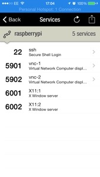
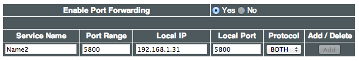
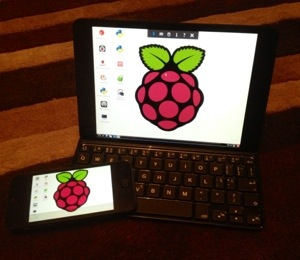

I recently published a popular post detailing a way to successfully [connect your Raspberry Pi to your iPad](../controlling-rpi-from-ipad). When I first set this up my main goal was to use the iPad as a useful display option and make use of the built in keyboard. This would make me more popular at home as I wouldn't need to steal the keyboard from the main PC or force the kids to watch me programming on the wide screen telly.

The earlier tutorial demonstrates how to set up and SSH and VNC connection between your Raspberry Pi and your iPad when both are on the same local network - i.e. you are stuck at home. When I discovered the joy of the Raspberry on my iPad, I wanted to take it with me so I could access during my lunch break at work. This requires a little more faff as I need to tell my router to allow access to the Raspberry Pi from an external network.

I've recently changed my network configuration and had to go through the process of setting this all up again, so I've taken the opportunity to publish another stage 2 tutorial explaining the process for setting up the network to allow remote control of a Raspberry Pi while away from home.

Starting completely from scratch you must initially set up the system to connect via SSH and VNC while at home using the local network

## First Stage - Set the Connection between iPad and Raspberry Pi from the Home Network

The first tutorial on [How to Control the Raspberry Pi](../controlling-rpi-from-ipad) from an iPad took you through all the stages from:

- Downloading the relevant apps <a href="https://itunes.apple.com/gb/app/fing-network-scanner/id430921107?mt=8&amp;uo=4&amp;at=1l3v7HE" target="itunes_store">Fing</a> (free), <a href="https://itunes.apple.com/gb/app/webssh/id497714887?mt=8&amp;uo=4&amp;at=1l3v7HE" target="itunes_store">WebSSH</a> (free) and <a href="https://itunes.apple.com/gb/app/vnc-viewer/id352019548?mt=8&amp;uo=4&amp;at=1l3v7HE" target="itunes_store">VNC Viewer</a> (free for a short time)
- Enabling SSH (Secure Shell Access) on the Raspberry Pi
- Connecting via SSH on the iPad or iPhone
- Setting up a Static IP address on the Raspberry Pi
- Installing a VNC Server on the Raspberry Pi
- Setting the VNC Server to run on boot
- Connecting via VNC on the iPad or iPhone

I suggest you refer to the [original tutorial](../controlling-rpi-from-ipad) to work through these stages.

## Second Stage - Setting up the Connection between iPad and Raspberry Pi from an External Network or 3G

In this section I will provide the step by step stages for setting up remote access:

- Determine Local and External IP address
- Determine the VNC port used by your Raspberry Pi
- Set up Port Forwarding on your Router
- Test whether the ports are open
- Connect remotely via SSH
- Connect remotely via VNC

During the set up I will mostly be connected on the same local network but in order to test the remote connection I need to switch to an external network. To save me rushing off to a neighbours house I just flick over to a 3G mobile connection on my iPhone which means I tend to flit between the iPhone and iPad during the set up. Its also worth noting that you need to be on the same network connection to use Fing to its full advantage - so my router has a 2G and 5G option and as my Raspberry Pi uses the 2G wifi I want to make sure all my other devices are uses the same connection.

### How to Determine Local and External IP address

Using my local SSH and VNC connection I enter the following script into the terminal to reveal my local IP address:

`ifconfig`

Note that this is even easier to do using the Fing app on your iPhone - ensure you are on the same wifi network as the Raspberry Pi and hit the refresh button on the Fing screen to display al the devices on your network and the relevant local IP addresses. We'll use this again later, so its really worth installing.

To get your external IP address you need to go to [What'sMyIP](http://www.whatsmyip.org/). You will only have one IP address per router so you can access this from any of your devices.

Jot both of these addresses down.

### How to Determine the VNC port used by your Raspberry Pi

I'm not entirely sure what a port is but your device will use a different port for different functions and you need to know the right one in order to allow external access to it. SSH uses port 22 VNC uses a range of ports in the format 59xx with 5900 being the most common. When I set up the VNC server on my Raspberry Pi in the first tutorial, it set up 5901 and this caused me quite a lot of consternation when setting port forwarding for 5900 didn't seem to work.

This is an optional extra step but it could save you a lot of bother.

Open Fing on the iPhone (or iPad) and refresh to view the devices on the network. Select the Raspberry Pi and then click on Scan Services. This confirms that ssh is on 22 and I've managed to set up 2 VNC servers on 5901 and 5902.

Jot down these numbers as these will be the ports we need to set up in the Port Forwarding stage.

### How to Set up Port Forwarding on your Router

Here's a quick introduction to port forwarding from [Lifehacker](http://lifehacker.com/5831841/know-your-network-lesson-4-accessing-your-home-computers-from-anywhere):

> By default, your local network is local and cut off from the rest of the internet. In most cases you have just one IP address that's shown to the world, despite the many that your router distributes to your individual computers and devices locally. What port forwarding does is take a port on that shared IP address that's available to the rest of the web and forwards it to one of your local machines. This lets people from outside access services on your local network.

So in order to access my Raspberry Pi from the outside world via SSH I need to tell my router that it is ok to accept external traffic on port 22 and forward that request to the Raspberry Pi (identified by the local IP address that we wrote down in step 1). If I want to connect to my Raspberry Pi through a VNC client I will need to set up port forwarding for port 5901.

NB. Other tutorials I've seen recommend forwarding the following ports for VNC: 5900, 5500 and 5800 so they might be the right ones for you but the previous step would help you determine for certain.

To set port forwarding you need to access your router controls. I am using the ASUS RT-N66U and that can be accessed by typing the IP address 192.168.1.1 in the browser address bar. When I previously accessed the internet via the Virgin Superhub the address was 192.168.0.1 If you are struggling to find the correct address just search for your router on the web.

You will need to explore the router access panel to find the correct area to enter port forwarding details or you can go to [Port Forward](http://portforward.com/cports.htm) which will almost certainly have the instructions you are looking for. Here's an example from the site that shows the details for forwarding port 5800 on my router.

I repeated this for ports 22, 5900, 5901, 5902, 5500 and 5800.

**Security considerations**

By setting up port forwarding you have effectively bypassed your networks firewall and potentially opened access to anyone. I don't know a lot about this area but I suppose it is best to keep your external IP address private but there is also password control for both SSH and VNC access to the Raspberry Pi.

### How to Test whether the ports are open

Having set up the port fowarding for a host of ports you might find it beneficial to test which ones are open and therefore ready to accept external traffic. [YouGetSignal.com](http://www.yougetsignal.com/tools/open-ports/ offers a simple and free service to enable you test multiple ports. When I checked mine I found that 22, 5901 and 5902 were open - just as I was expecting from the Fing scan.

Now that I've successfully got open ports for both SSH and VNC I can move on to the next stage and try to connect my iPad and iPhone remotely.

### How to Connect remotely via SSH

The instructions are the same for the iPhone and iPad but I will test this on the iPhone so I can easily switch to my mobile phone network in order to test external access.

Open your SSH app (I'm using [WebSSH](https://itunes.apple.com/gb/app/webssh/id497714887?mt=8&uo=4&at=1l3v7HE)) and add a new connection and fill in the following fields:

Name - Any descriptor such as Remote Raspberry Pi
Host - this will be your external IP address
Port - this should already be completed and will be 22
User - if you haven't amended your Raspberry Pi login details this will still be pi
Password - probably raspberry

Now you need to hit connect and hope for the best. Hopefully you will be rewarded with the command prompt. This will work with both home and remote connections.

### How to Connect remotely via VNC

Open <a href="https://itunes.apple.com/gb/app/vnc-viewer/id352019548?mt=8&amp;uo=4&amp;at=1l3v7HE" target="itunes_store">VNC Viewer</a> on your iPhone (same instructions for iPad) and set up a new connection.

>Address: this is you external IP address followed by  a : and a one or two digit number representing your port such as 82.44.11.1:0 (mine ends :1 because its port 5901)
Name: Anything descriptive eg RPiExternal

If you hit connect know you should hopefully see the beautiful raspberry on your screen. Congratulations.

## Next Steps

Having gone through that almighty palaver to set up your connections bewteen your Raspberry Pi and your iPhone and ipad you may not be particularly excited about the thought of your external IP address changing. Some routers allow you to set up a single DNS which ensures you have a static name to use for external connection rather than the numbered IP address which might change. If you us an ASUS router you can find more detail [here](http://asusddns.appspot.com/).

## Useful External Sources

- Whatapalaver Stage 1 Tutorial: [How to Connect your iPad and Raspberry pi on a Home Network](../controlling-rpi-from-ipad)
- Lifehacker: <a href="http://lifehacker.com/5831841/know-your-network-lesson-4-accessing-your-home-computers-from-anywhere">Accessing your Home Computers from Anywhere</a> - this includes some very useful and well explained information on port forwarding
- Lifehacker: <a href="http://lifehacker.com/5902654/use-your-home-computer-from-anywhere-a-comprehensive-guide-to-remote-controlling-your-pc">Comprehensive Guide to Remote Controlling your PC</a> - this doesn't mention the Raspberry Pi but does provide excellent information to help you connect remotely to your PC or Mac.
- <a href="http://portforward.com/">Port Forward</a>: This is the go to source for router specific port forwarding instructions.
- <a href="http://www.everydaylinuxuser.com/2013/06/connecting-to-raspberry-pi-from-outside.html">Everyday Linux User</a>: This tutorial set me off on the right track.
- <a href="http://www.yougetsignal.com/tools/open-ports/">You Get Signal</a>: This is a simple tool that tells you whether you've successfully managed to open the ports to external traffic. It saved me banging my head against a brick wall on a few occasions.
