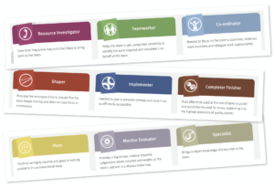

In management speak, individuals can apparently be categorised into one of nine different <a href="https://www.belbin.com/about/belbin-team-roles/">Belbin personality types</a> such as: Implementer, Co-ordinator and Resource-Investigator.

I’ve always had issue with Belbin as he never fully accounted for me. He missed Starter-Leaver from his list and in doing so disenfranchised me. Unforgivable!

I married a completer-finisher which from my perspective is the perfect coupling. I flit from one idea to the next, kicking off projects in my wake, and my partner rushes around trying complete them.

I suspect she finds it less than ideal.

Fortunately my experience so far at Makers suggests that the Starter-Leaver personality type is ideally suited to the fast paced curriculum.

There are only 12 weeks in total (10 left to go) before we are thrown to the job market and expected to hold our own in a competitive market. The fact that the gong of success, chimes on a regular basis shows that graduate Makers do compete and secure jobs in that market but that experience is intense and at times overwhelming.

I liken the bootcamp experience to a high speed educational train which gathers pace as it passes through each new station or concept. I’ve decided the best way to stay sane is to cling onto that train for dear life and just hope you learn enough en-route to appreciate the view and make it to the next station.

That’s not an easy thing to do. It’s is pit-of-the-stomach uncomfortable to leave a challenge incomplete and poorly understood, only to move to the next, ever so slightly harder challenge.

The temptation is to get off the train at the early stations and pause while you truly appreciate its wonder. The trouble is when you get to the point where you think you might be able to move on, the train is already entering the station two stops ahead. You are a little bit stuffed now and have to bolt down the track missing everything in the hope of catching up.

<iframe src="https://giphy.com/embed/xUA7bdrXps7IlbZGzS" width="480" height="270" frameborder="0"></iframe>

<a href="https://giphy.com/gifs/golden-girls-wedding-xUA7bdrXps7IlbZGzS">via GIPHY</a>

I tried this approach in week 1 when we were introduced to RSpec. I looked at my spec files and thought “Jeez that is ugly” I must be pretty useless at RSpec and my future career as a hotshot coder is now in jeopardy. I did some tutorials and discovered there was lots more to learn, in fact there was almost an encyclopaedic volume of RSpec knowledge I was unaware of.

I bought a book using £17 of my hard earned savings. I read two chapters, planned to start the included tutorial and then looked around to notice that the cohort had moved onto to the next challenge and the weekend was looming. Already behind, I put the book and all promises of become a world class RSpec expert aside and moved on.

As a starter-leaver I have accustomed myself to leaving things unfinished and I can just about cope with the discomfort of not knowing everything.

I’m noticing that some of my colleagues are having their own struggles with the pace. Others also feel worried to move on while they still don’t understand the basics and want to spend the time cementing their knowledge. I have a lot of sympathy for this feeling but my advice is to just cling onto that train and hope your finger nails haven’t ripped out before the next station.

<iframe src="https://giphy.com/embed/3orieZKpEaP6qUqOEo" width="480" height="362" frameborder="0"></iframe>

<a href="https://giphy.com/gifs/season-16-the-simpsons-16x21-3orieZKpEaP6qUqOEo">via GIPHY</a>

It’s deeply unnerving but is the only way to not miss the train for good. Luckily we have coaches that are there to help with your grip, but ultimately, I think we all need to get used to discomfort.

Going back to my RSpec inadequacy. I never had chance to go back to my book but we’ve gone over RSpec numerous times in the challenges that followed the first exposure. If I look at my spec files now I am amazed at how they have changed. I am using contexts and describe blocks, stubs and doubles and that is all without dedicated RSpec-only practice.

The point is the basics get repeated as you stretch yourself with ever harder tasks.

Learn to be content with leaving stuff unfinished and less than perfect and ultimately - Just hold on!
