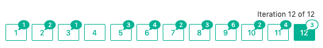

If you want to attain mastery of anything you are going to have to accept that you start out being pretty useless. If your end goal falls under the remotely ‘challenging’ remit, then you need to accept that you will repeatedly stumble and look like a bit of a newbie for a long time.

My current challenge is to become a coding rock star, unfortunately at the moment I’m more like an irritating kid learning the violin - I’m producing a lot of screeches and not a lot of rock.


I am deep in the middle of my Imposter Syndrome, feeling like I'm ready to fall, but I’m trying to embrace it rather than smother it.

I heard Rob Faldo talk about the imposter syndrome on his [https://career-switching-coders.simplecast.com/](career switching coders) podcast the other day. He said that when he comes across a new bit of code that he doesn’t understand, he immediately feels as though he must be the buffoon because clearly everyone else was born with that particular algorithm imprinted in their brains. It wasn’t as if they each had to encounter it for the first time and then take the time to learn it.

It’s super tempting to try and hide our individual ineptitudes. To struggle on and slowly craft a solution that works even if it feels a bit rickety and has a faintly malodorous whiff about it. However, it’s only by exposing our weaknesses that we open ourselves to learn from the experiences of others - by seeking feedback we get to hone and craft our code.

I work in quite a small team and while that means I get exposed to plenty of non-trivial challenges and get to grapple with things independently, I suspect it also means there is less time for rigorous code review. That lack of scrutiny risks slowing my journey to mastery and is why I started training with Exercism.io

[https://exercism.io/](Exercism.io) is designed to hone your programming skills by providing you with a defined language path and a mentor to scrutinise your code. It is completely free and supported by volunteer mentors. It is this mentorship element that makes exercism such a fantastic way to improve your fundamental programming skills.

I’m about 40% of the way through the Ruby track and have just finally signed off my solution to an optional side project after 12 iterations and 29 comments! 29 comments between me and my mentor on what ended up being a 40 line piece of code.



It's tempting to suggest I must be a pretty shoddy coder to need that much feedback and that many attempts. I was only trying to add up rice grains on a chessboard. Really… how hard can that be?

Instead I am trying to embrace the growth mindset and celebrate those 29 opportunities to learn some cool stuff and experience a pretty rigorous code review.

The challenge related to grains of rice on a chessboard. You start with 1 grain on square 1 and double it for each square beyond. You need to know how many grains on the total board and how many on any given square.


My first attempt wasn’t too bad. All the tests passed. Without review that could have made it into the codebase and functioned. It wasn’t very efficient though, iterating through every square on the chessboard regardless of the square I was interested in, it wasn’t terribly obvious what was going on and it had some magic numbers that tied me in to always using a chessboard.

```ruby
class Grains

  def self.square(square_no)
    raise ArgumentError, 'Square must be between 1 and 64' unless square_no >= 1 && square_no <= 64
    chessboard[square_no - 1]
  end

  def self.chessboard
    chessboard = []
    (1..64).each do |square|
      chessboard <<
        if square == 1
          1
        else
          chessboard[square - 2] * 2
        end
    end
    chessboard
  end

  def self.total
    chessboard.sum
  end

end
```

By the end I’d really grasped the nature of class and instance methods, done a bit of maths and refactored my method names a number of times.

```ruby
class Grains
  LOCATIONS = (1..64)
  MULTIPLIER = 2

  def self.square(location)
    new(location).square
  end

  def self.total
    new(LOCATIONS.min).total
  end

  private

  def initialize(location)
    unless valid?(location)
      raise ArgumentError, "BoardLocationError: Must be between #{LOCATIONS.min} and #{LOCATIONS.max}"
    end

    @location = location
  end

  def valid?(location)
    LOCATIONS.include?(location)
  end

  def position_total(index)
    MULTIPLIER.pow(index)
  end

  public

  def square
    position_total(@location - 1)
  end

  def total
    position_total(LOCATIONS.max) - 1
  end
end
```

It was a fantastic learning experience for me. We even discussed further improvements that separate the concerns between Grains and Board and utilised modules for the latter. These didn’t make it into my final solution as I was limited by the test suite but it didn’t effect the knowledge gained along the way.

Exercism.io is a great gift to the programming community and I hope when I finally achieve my Rock Star status I won’t forget to give back and do my own bit of mentoring.
