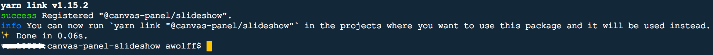
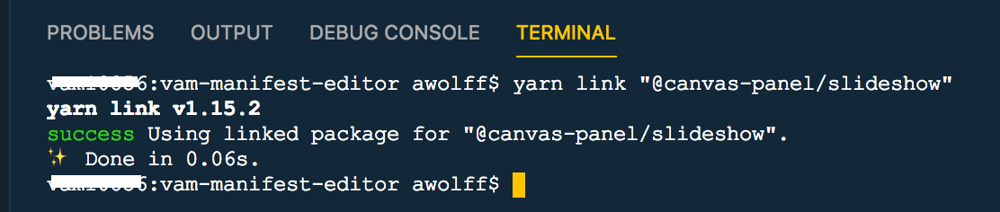
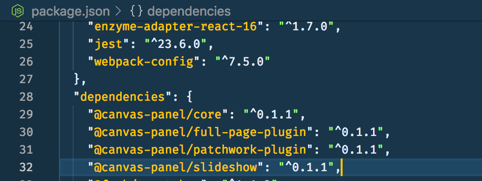
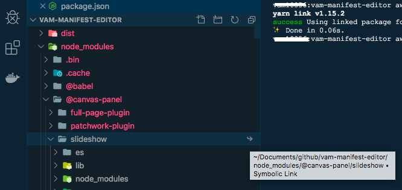

## Changing code in an npm dependency - how hard can it be

There’s a bug in one of my dependencies and I’d like to try and fix it so I can submit a pull request to the original repo. So far I have been unable to fix the original bug but I have learned so much about npm packages and how to change code in project dependencies that I thought I better write a blog post for posterity.

## Don’t change code in node modules

As I was anticipating a really trivial fix, I thought I would just amend the code directly in the relevant node_modules folder. Test the fix and then submit a pull request.

Of course it is advisable never to touch the code in your node modules folder, for one thing all your changes will be overwritten when you run npm install (or yarn) and no-one else will be able to replicate when they use your repo as you don’t check node modules into git. Still, I was focussed on the teeny tiny fix and went ahead and tweaked my node modules code anyway.

The other reason for not changing code in node modules then became apparent. I just could not get the code change to replicate in the browser. I wasted loads of time tweaking my fix before I even realised it was not affecting my browser.

It turns out that webpack ignores node modules by default and it’s actually quite tricky (I haven’t fathomed out how) to get it to recompile all the javascript modules into ES5 flavoured javascript for the browser.

## Can I just fork the original repo and point to that in package.json

Well this is much closer to the ideal approach. You can reference a GitHub repo in your `package.json`.

e.g. `git+https://isaacs@github.com/npm/cli.git`

However, you may find that this won’t work for you as the original repo may not have the `dist` folder checked into git - you rarely do this.

As a recap, the `dist` folder holds all the compiled scripts (in ES5) ready for your browser to consume. The `dist` folder is typically generated when you run the `build` command.

## Using a forked repo and local clone to amend nodeJS packages

I have a project that has canvas panel as a dependancy. It has an element that appears as a visual irritant in my project. It's something that at first glance looks like an easy fix and I would like to patch it but in order to test my attempts I need to update canvas-panel and see the impact on my project.

Here are the steps:

- Fork the repo with your dependency, in this case [https://github.com/digirati-co-uk/canvas-panel](https://github.com/digirati-co-uk/canvas-panel)
- Clone to your local machine
- Create a branch for your fix (important if you hope to issue a PR)
- Make the desired changes
- Build the forked repo in order to compile the changes into es5 using either `mpm run build` or `yarn build`
- Now you need to perform a global npm symbolic link (see below) so that npm knows to look in your local copy for the dependancy files and tell your project to use this new linkage
- Re-run your application and confirm that your changes have resolved the irritating problem (or not as was the case for my apparently simple fix)

### Creating an npm link to a local copy of the dependancy

- Enter the the relevant package folder in your cloned repo. In my case I want to be in canvas-panel-slideshow
- Create the global link here using `yarn link`

- Got to your project repo and tell it to use this new symbolic link using `yarn link "@canvas-panel/slideshow"`

- You won't see any changes in package.json
  

- If you look in node_modules though you will see the symbolic link icon

- If you change the code in the cloned dependancy repo and then rebuild, you will be able to see these changes replicated in your projects node_modules.
- At this stage you can run your project application and see the impact of your coding change.

### Push, PR and remove link

Providing your code change worked, you may choose to push the branch and then issue a pull request. At this stage you will have a remote copy of the amended dependancy. You can now remove the symbolic link and point your package.json at the remote forked repo (assuming it will take some time for your PR to be merged - if at all).

Removing sym links involves a reversal of the above process:

- in the forked repo package folder run `yarn unlink`
- in your project folder run `yarn unlink "@canvas-panel/slideshow"`
- now run `yarn` or `yarn install` in your project to re-install the package

## External references

- [How to fix a nodeJS package within your app. And send a pull request with your changes (uses npm)](https://medium.com/@nodkz/how-to-fix-nodejs-packages-within-your-app-and-send-pull-request-with-your-changes-8b4dcb89492b)

- [How to fork a dependency and use it locally in a project (uses yarn)](https://medium.com/@chrisdmasters/how-to-fork-a-dependency-and-use-it-locally-in-a-project-707c80d3449c)
