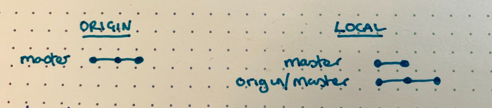
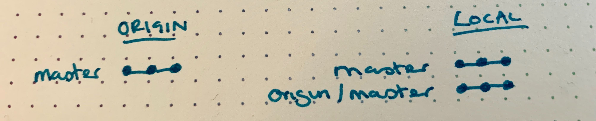
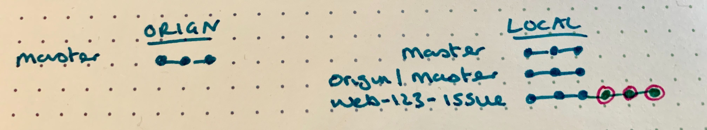
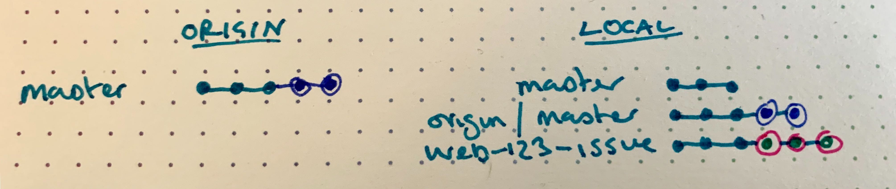
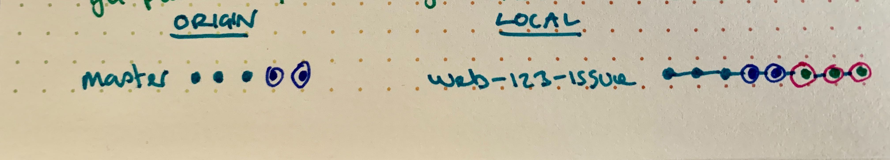

For super clear details of a [rebase workflow](https://medium.com/singlestone/a-git-workflow-using-rebase-1b1210de83e5) see this blog by Singlestone.

Currently we are all working from branches directly taken from the main repo rather than forked repos, so I've outlined a reduced version here:

```bash
git remote --verbose

>>
origin htps://githib.com/vanda/vam-web.git (fetch)
origin htps://githib.com/vanda/vam-web.git (push)
```

## Step 1 - git fetch

Git fetch stores the contents of origin/master locally

`git fetch`



## Step 2 - Merge origin/master into local master branch

```bash
git checkout master
git merge origin/master
```

This fast forward merge leaves master and origin/master pointing at the same commit



## Step 3 - Create an issue branch - Write Code - Commit

`git checkout -b web-123-issue`



## Step 4 - Fetch origin again to pick up remote changes to master

`git fetch`



## Step 5 - Rebase issue branch and rebase (&squash) against origin/master

Ideally you perform the rebase against the branch that you plan to merge into (usually master).
Squashing of commits happens in interactive mode.

`git rebase --interactive origin/master`

Enter insert mode (ESC i) replace 'pick' with the appropriate command.
Save and exit

```bash
pick f7bdce52 Add cool new feature
fixup 8fd484e6 rubocop fixes
squash 8ef791db Specifying postgres port
# Rebase 66f6679c..8ef791db onto 66f6679c (3 commands)
#
# Commands:
# p, pick = use commit
# r, reword = use commit, but edit the commit message
# e, edit = use commit, but stop for amending
# s, squash = use commit, but meld into previous commit
# f, fixup = like “squash”, but discard this commit’s log message
# x, exec = run command (the rest of the line) using shell
# d, drop = remove commit
#
# These lines can be re-ordered; they are executed from top to bottom.
#
# If you remove a line here THAT COMMIT WILL BE LOST.
#
# However, if you remove everything, the rebase will be aborted.
#
# Note that empty commits are commented out
```



## Step 6 - Push your branch

If this is the first time you've pushed this issue branch:

`git push --set-upstream origin web-123-issue`

however if you've already pushed the branch you need to force the push:

`git push --force origin web-123-issue`

## Step 7 - Pull request away
