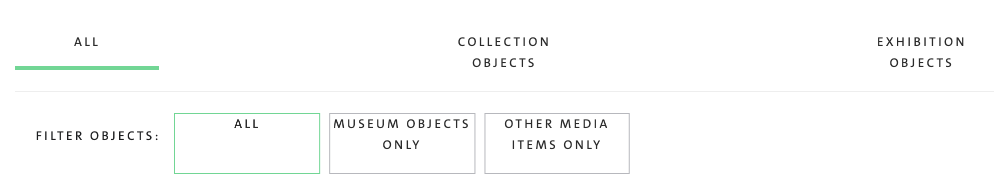

## Adding a button to a Rails View that Refreshes the page while applying new Parameters

I have a Rails view that is acting as a dashboard and it displays a list of Objects that we have in our database. I have 3 filters across the top of the page that enable me to show subsets of these Objects depending on whether they are within a Collection or within an Exhibition.



The filters work by passing a filter parameter to a `link_to` path which I then handle in the controller and restrict the Objects returned using a merge query.

Here's the extract from the dashboard view showing the filters:

```erb
<!-- dashboard.html.erb -->
<div>
  <ul>
    <li> <%= link_to 'All', admin_dashboard_path() %> </li>
    <li> <%= link_to 'Collection Objects', admin_dashboard_path(filter: :collection) %> </li>
    <li> <%= link_to 'Exhibition Objects', admin_dashboard_path(filter: :exhibition) %> </li>
  </ul>
</div>
```

I then `<%= render 'object_table' %>` to display a table with the following headings:

```erb
<!-- _object_table.html.erb -->
<table>
  <tr>
    <th>Object Id</th>
    <th>Accessioned?</th>
    <th>Unique Id</th>
    <th>Media Item Id</th>
    <th>Default Credit</th>
    <th>Override Credit</th>
    <th>Copyright</th>
    <th>Edit View</th>
  </tr>
```

We have a lot of objects, the resulting table was massive and the 3 filters were just not proving sufficient to yield manageable subsets.

I decided I wanted to add further filters based on their Accessioned status which is a boolean true or false.
I could add these as filters but the 3 x 3 combinations would lead to an ugly as hell 9 option filter bar, when really all I wanted was a toggle button to further refine my Objects according to Accessioned Status.

I imagined that what I required was 3 links (stlyed perhaps as buttons) that acted to refresh the page, thereby maintaining the existing `params[:filter]` but add an additional parameter with the accessioned status.

## Creating a Link in a Rails View to refresh the Page

You can create a refresh link using something like:

```erb
<%= link_to "reload", url_for(params) %>
```

The moment you start using params you will need to permit them in your controller otherwise you'll get unpermitted parameter errors. Check out the Using Params link for a good overview. My dashboard isn't following RESTful routes and it isn't backed by a model so I have a slightly reduced method for declaring my permitted parameters:

```ruby
# dashboard_controller.rb

def dashboard_params
  params.permit :accessioned, :filter
end
```

So I am at the stage now where my existing page (with its 3 filters) will pass params ie.

```
All -> # no params
Collection Objects -> Parameters: {"filter"=>"collection"}
Exhibition Objects -> Parameters: {"filter"=>"exhibition"}
```

The 'reload' link will pass the same parameters.

## How to Add a New Parameter Attribute to a link_to

Parameters are just hashes so if you want to add a new key value pair you can use `merge`

So to add accessioned status = false to whatever filter already exists:

```erb
<%= link_to "Accessioned (False)", url_for(@dashboard_params.merge(accessioned: :false)) %>
<%= link_to 'Accessioned (True)', url_for(@dashboard_params.merge(accessioned: :true)) %>
```

If I want the user to be able to remove this Accession status filters I need to remove the :accession attribute from the parameter with:

```erb
<%= link_to "All", url_for(@dashboard_params.merge(accessioned: nil)) %>
```

So in combination with the top level filters we can cycle through the following parameter options

```
All -> # no params
Collection Objects -> Parameters: {"filter"=>"collection"}
Exhibition Objects -> Parameters: {"filter"=>"exhibition"}
Accessioned Collection Objects --> Parameters: {"accessioned"=>"true", "filter"=>"collection"}
Non-Accessioned Collection Objects --> Parameters: {"accessioned"=>"false", "filter"=>"collection"}
Accessioned Exhibition Objects --> Parameters: {"accessioned"=>"true", "filter"=>"exhibition"}
Non-Accessioned Exhibition Objects --> Parameters: {"accessioned"=>"false", "filter"=>"exhibition"}
```

## External Links

- [External blog - link to current page with additional params](https://solidfoundationwebdev.com/blog/posts/link_to-current-page-plus-additional-parameters-in-rails)
- [Using params](https://www.rubyguides.com/2019/06/rails-params/)
