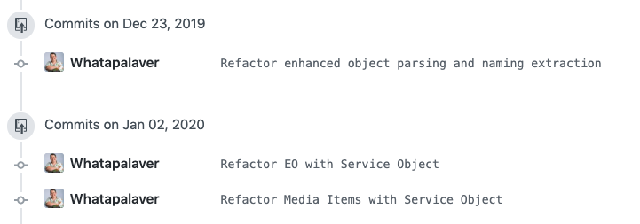

Before creating a pull request you typically have to perform a rebase against the branch you are merging with (typically origin master), I've written a visual guide to that [git-workflow process](../git-rebase-workflow). Part of this rebase process allows you to cleanse history and perform some tidying up of your commits. Nobody wants to merge a series of commits along the lines of:

```zsh
ad206a88 wip trying to fathom this sh**
5cbf801e Yay did it!
4ec345a4 Rubocop annoyance
4e24444 More rubocop
4eczxd3 Jeez now my tests are failing!!!!
5ec3333 Fixed test
44ec344 Rubocop annoyance re-visited
```

Sometimes you want to be able to perform this tidy up process without performing a merge against another branch. For example I may have previously performed a merge & rebase but then changed the README along with some minor refactor work and some rubocop annoyances thrown in for free. There is no need to perform another rebase against master as nothing has changed there.

In order to perform an in-situ commit squashing exercise run the following, replacing the '7' with the the number of commits you would like to review.

`git rebase -i HEAD~7`

This then throws up the interactive editor, which you amend using your top notch VIM skillz.

- `ESC i` to get into insert
- Change the pick keyword as required (following the instructions)
- `ESC :` to get to the command mode
- `wq return` to write and quit

```zsh
pick ad206a88 Refactor enhanced object parsing and naming extraction
fixup 4ec345a4 Rubocop annoyance
pick 5cbf801e Refactor EO with Service Object
pick 44ec344 Refactor Media Items with Service Object
fixup 4e24444 More rubocop
fixup 4eczxd3 Jeez now my tests are failing!!!!
fixup 5ec3333 Fixed test
```

You can now push your branch:

If this is the first time you’ve pushed this issue branch:

`git push --set-upstream origin web-123-issue`

however if you’ve already pushed the branch you need to force the push:

`git push --force origin web-123-issue`


