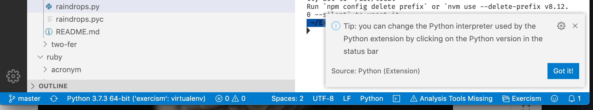

Early in my developer career I was given some ‘rules’ for working with python that resulted in me having a near terror response whenever I considered starting a python project.

- Always work within a virtual environment
- Keep all your virtual environments together

The rules seem insipid enough, so why all the fear and loathing?

Having diligently installed `virtualenv` and told `pip` that under no circumstances should any python dependencies be installed outside of a virtual environment, I became locked out of a world that I didn’t yet understand.

- Do I create a virtual environment for each python project?
- If I keep all my virtual environments together does that mean all my project code has to stay with the virtualenv?
- How does virtualenv work with github? Do I commit my venv stuff? How can I work on a venv both at work and at home?
- How do I associate a virtual environment with an existing python project?

Having turned my back on the python world for the last 10 months, I’ve recently starting trying it out again. A fab data processing course on Coursera has inspired me to recommit to my python journey and I’m now full steam ahead with the [exercism python track](https://exercism.io/).

All great news, but the long cold night of virtualenv has come back to bite me. I wasn’t able to use modern python 3.3 features such as type hinting without installing a pep interpreter and I couldn’t do that without activating a virtualenv. So I was very quickly spiralling back around the 4 questions above.

So this morning I decided it was time to suss our virtualenvs once and for all and create myself a new set of rules for working with python in virtual environments. Here's how I resolved all my virtualenv struggles.

## Installing virtualenv and virtualenvwrapper

Install [virtualenv](https://virtualenv.pypa.io/en/stable/installation/)

- `pip install virtualenv`

Install [virtualenvironmentwrapper](https://virtualenvwrapper.readthedocs.io/en/latest/install.html) into the global site package where virtualenv is installed

- `pip install virtualenvwrapper` or
- `sudo pip install virtualenvwrapper`

## Creating virtual environments, activating and deactivating

- create a virtual environment with `mkvirtualenv -p python3 new_project`
- activate the virtual environment with `workon new_project`
- deactivate the virtual environment with `deactivate` or switch to a different virtual environment with `workon diff_project`

## Where to save virtual environments and how to structure your python projects

If you follow my advice and use virtualenvwrapper, all your virtual environments will be saved in your home directory in a folder called .virtualenvs

Creating a new virtualenv with the command `mkvirtualenv -p python3 new_project` will result in a further folder `new_project` being created within `.virtualenvs` ready to hold onto your project dependencies.

You don’t really need to spend any time in `.virtualenvs`. You don’t need to look at it, or worry yourself about it and you certainly don’t want to start writing any code in here.

So now we have a spanking new virtualenv running python3, it’s time to create a new python project. Head off to the place you like to store your programming projects and make a new directory for your code. For me that is something like `Documents/coding/python/whizzy_new_project`

Go ahead and write your code. I happen to use vscode but just use whichever IDE or text editor you please.

When it becomes time to test your code or run it, or have any interaction with it from a terminal perspective (eg using pip to install something) you are going to need to activate your virtual environment.

The joy of virtualenvwrapper is that you now have a handy convenience instruction `workon` which means you don’t have to worry about paths and such like.

So in order to activate my virtualenv I just open a terminal and run `workon whizzy_project`, where 'new_project' is obviously whatever name you gave to your new virtual environment. I don’t need to worry where I am when I run this command.

If I open a new integrated terminal from within vscode it is automagically associated with this activated virtualenv but it is also easy enough to poiy it at the right interprer.

Now when I run my python script it can use the python interpreter installed as part of the virtual environment and can install whatever further dependencies are required by the project.

## What about github and my python virtual environments

- Don’t enter venv stuff in your git repo
- If you keep your venv totally separate from your project code you won’t even need to worry about shoving venv related stuff in your gitignore file
- Spin up a requirements.txt file and commit that. This means that any clones of the repo can readily install all the dependencies in _a new venv_

## I want to clone a repo that does/doesn’t use a virtualenv

If you want to clone a repo, perhaps your own repo that you want to have on multiple machines or someone else’s project that you want to work on - the virtual environment status of that remote repo is irrelevant to you. There shouldn’t be any venv stuff in that repo and so no real clues as to whether the original host used a venv or not.

All you care about is that you want to use virtual environments in your machine. So create one!

- create a virtual environment with `mkvirtualenv -p python3 new_project`
- Go to the folder where you store your projects
- Download the remote project here with `git clone ....`
- Activate the virtual environment with `workon new_project`
- cd to your project folder
- `pip install` to populate your new venv with the dependencies listed in the repos requirements.txt

## I’ve got an existing python project. How can I associate it with a virtual environment

It’s probably not the best idea to conceptualise this working pattern as ‘associating’ a venv and a project.

You are free to activate any old venv and use it with your project. So I might have a python2.7 venv and a python3.3 venv and using the workon command I could flip the same project between the two environments at will. Not sure why I would want to do that as my whizzy new python3 code wouldn’t work in a 2.7 environment but you might want to test different releases of packages.

Anyway, back to the question.

Lets say I have an existing project called ‘blog’ and I want to ‘associate’ it with a new virtual environment.

- Within the root of the blog directory, generate a requirements.txt with `pip freeze > requirements.txt`
- Create a venv with `mkvirtualenv -p python3 blog`
- Activate this venv with `workon blog`
- `pip install`
- All dependencies are now isolated in the virtualenv
