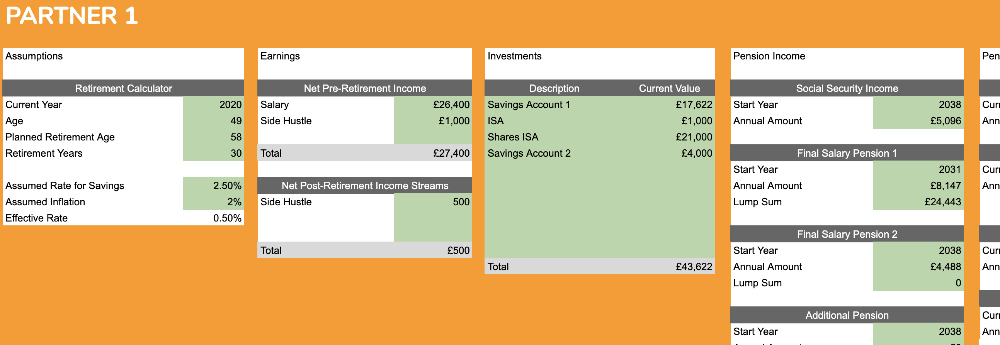
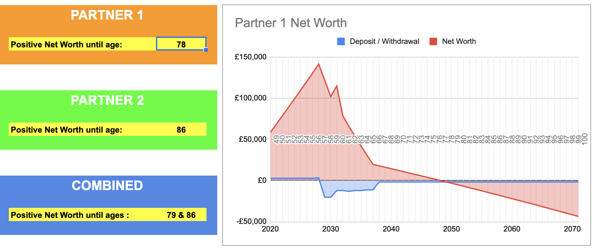
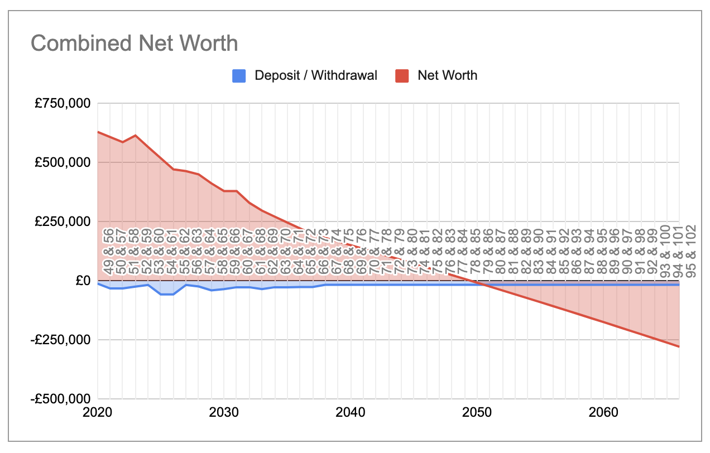

Couples choose to manage their individual and combined finances in many different ways, most having individual savings accounts and pension pots acquired from an assortment of jobs. Understanding the financial contribution that both parties are bringing to the retirement phase of life can be tricky.

I've created a google sheets spreadsheet so that my wife and I can track our investment pots, current and future income and expenditure to determine how long our money will last. It enables us to do some scenario planning such as the impact of retirement age or monthly expenditure on our long-term financial stability.

I've made the [couples retirement planning spreadsheet](https://docs.google.com/spreadsheets/d/1QDjTUro46UcosuQNeYEiL5xQInYb55DrPX0iWZcGLXc/copy) available for you all to copy to your own Google Drive so that you can review your combined and individual state of Financial Independence.

We've both incurred some financial shocks in recent years, such as redundancy and financially catastrophic (but mentally rewarding) career changes. It's been really useful to see our financial position laid out so clearly. For me it provides some reassurance that we will be ok and that our retirement years do not need to be characterised by hardship in any way. I tend to be a little cautious and would prefer not to see my net worth dipping below zero until I'm at least 100, so it means I won't likely be retiring before I reach 60. However, if my income improves over the coming years, and why the heck wouldn't it, early retirement might well be back on the cards.

## Inspiration for the Couples Retirement Planner

FIRE or Financial Independence Retire Early is all the rage nowadays. It's perhaps come a bit too late for me to exploit to the full but the concept is simple and pretty inspiring. If you can save 40 times your annual expenditure you will have achieved financial independence and can retire immediately.

This concept is compelling and proponents work to drmatically drive down their expenditure using techniques like geopgraphic arbitrage (living abroad) or just general downsizing. They also drive up their income and probably don't opt for salary slashing career changes in their mid-life.

I read about FIRE in (Amazon links):

- [Quit Like a Millionaire](https://amzn.to/33oS9Cr)
- [Choose FI](https://amzn.to/2U650VN)
- [Playing with FIRE](https://amzn.to/2wSR0Hh)

all of which are worthwhile reads for anyone concerned about their finanical future.

Advice tends to be very US centric though while my spreadsheet will be more useful to UK residents. The concepts in the FIRE books are still relevant though and I'd recommend particularly to the younger generation who are concerned about their inability to get on the property ladder - it could be your lifeline to financial freedom.

## How to Use the Couples Retirement Planning Spreadsheet

Link to the [Couples Retirement Planning Spreadsheet](https://docs.google.com/spreadsheets/d/1QDjTUro46UcosuQNeYEiL5xQInYb55DrPX0iWZcGLXc/copy)

The Config tabs are where all the action is at. At the top there are some cells shaded in khaki where you should fill in all your own details such as planned retirement age, assorted incomes, pension pots, expenditure budgets etc. I've pre-populated with some example figures (loosely based on my own scenario).

Underneath the data settings are some charts and a little dashboard showing what age you will be when your pot finally runs out - if indeed it does! Some people wish to ensure there's a substantial nest egg left to pass onto offspring, while others are content to reach the finish line with only coppers left.....

Here's the all important combined net worth picture - this is a partnership for the longhaul, afterall.

## Couples Retirement Planning Spreadsheet - Details

Hopefully the configuration details are clear enough but here are a few notes about each section.

### Assumptions

These are mostly obvious.

Assumed rate for savings is a gross annual savings figure. Typically investment planners would work on the basis of 5-7% but that would require you to be investing in quite an aggressive fashion with presumably a high proportion of stock market exposure. I'm cautious and as COVID19 is playing havoc with stock markets and interest rates, I'm plumping for a miserable 2.5%.

I've also assumed inflation at 2%.

The important figure is the Effective Rate which is your annual savings return less inflation. This is the percentage that is applied across all your investment pots and allows you to avoid hideous inflated expenditure calculations. Everything can be expressed in terms of todays value.

### Earnings

Hopefully obvious. There's space to add a few different income sources. Note that there's a section for current income and post retirment income which could be of use where you have passive income sources or a desire to continue some casual work.

### Investments

These are just savings pots other than specific pension investments. So stocks, shares, ISAs bonds, property - whatever interest bearing assets you have. Not your own home though - that's an expense and if you don't know what I'm talking about, read [Rich Dad, Poor Dad](https://amzn.to/3aUM2bv)

### Pension Income and Pension Investments

I've split my pensions into two categories. The first being for those that will definitely be converted to an income at a certain age such as social security pensions and final salary pensions.

I've also got a pension investment list which includes stakeholder pensions and otehr employment pensions that I can either take as a lump sum or choose to purchase an annuity.

### Expenditure

This is my monthly budget, with the categories that I use in the most fabulous YNAB - [You Need a Budget - Budgeting Software](https://ynab.com/referral/?ref=FQg06IUC6gZoCZb1&utm_source=customer_referral). There are two columns, one for now and one to reflect the hopefully reduced post retirement expectation.

### Annual Splurges

The assumption is that anything left (positive or negative) after my budgeted expenditure will be invested in an interest bearing vehicle of some kind. This splurges table is just a way for me to account for the unexpected stuff that I haven't chosen to budget for - although if you do use YNAB, you will know that I should have budgeted for it!

It makes me happier to account for irregular future expenses like the occassional mega holiday or car replacement.

### Net Worth Tab

This is where the calculations happen. You don't need to touch this sheet, although you can if you know what you are doing. If you don't, you will break it. I haven't protected anything.

So thats it - go forth and plan and then enjoy your retirement! Let me know how you get on with the spreadsheet and if you can think of any improvements.
